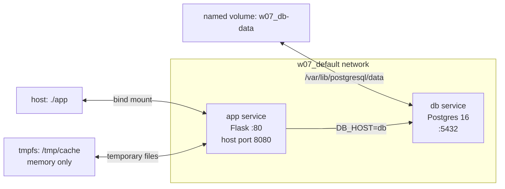

# W07｜Docker Compose 與資料持久化

## 拓樸圖



## 從 docker run 到 compose.yaml

我最有感的改善是「重現部署」變簡單很多。以前用 `docker run` 要記得先建 network、再建 volume、再把兩個 container 的環境變數和掛載都打對，只要漏一個參數就會變成另一套環境。改成 `compose.yaml` 後，app、db、port、volume、healthcheck 都寫在同一份檔案裡，之後只要 `docker compose up -d` 就能把整組服務帶起來。

## 三種掛載對照

| 掛載類型 | 路徑（host） | 容器砍重起資料還在嗎 | 重啟容器資料狀態 | 適合情境 |
|---|---|---|---|---|
| named volume | Docker 管理的 `w07_db-data`，實際在 `/var/lib/docker/volumes/w07_db-data/_data` | 在，只要沒有執行 `docker compose down -v` 或刪 volume | `notes` table 的資料仍可查到 | 資料庫資料、需要跨容器重建保存的資料 |
| bind mount | 專案目錄的 `./app` | 在，因為檔案本來就在 host 專案目錄 | 改 `app/app.py` 後容器內 `/app/app.py` 立刻看到同樣內容 | 開發 source code、需要 host 編輯器即時同步 |
| tmpfs | 沒有落地到 host 磁碟，存在記憶體 | 不在，容器重啟後內容清空 | `/tmp/cache/x` 重啟後消失 | 暫存檔、cache、敏感資料短暫存放 |

## healthcheck 前後對照

| 寫法 | curl /healthz t=1s | t=3s | t=5s | t=10s |
|---|---|---|---|---|
| 只 depends_on | 503 | 503 | 503 | 200 |
| service_healthy | connection refused | connection refused | connection refused | 200 |

觀察（自己的話）：  
只寫 `depends_on` 時，Compose 只確認 db 容器有開始啟動，沒有確認 Postgres 已經可以收連線，所以 app 會先起來但 `/healthz` 回 503。加上 `healthcheck` 和 `condition: service_healthy` 後，app 會等 db 通過 `pg_isready` 才啟動；前面幾秒可能連 app port 都還沒開，但 app 一旦起來就能直接連到 db。

## 排錯紀錄

- 症狀：`curl http://localhost:8080/healthz` 回 `db unreachable`，HTTP 狀態是 503。
- 診斷：看 `docker compose logs app` 後發現 app 已經啟動，但 db 還沒 ready，單純 `depends_on` 只等容器啟動，不等資料庫服務健康。
- 修正：在 `db` service 加上 `healthcheck`，使用 `pg_isready -U postgres -d $${POSTGRES_DB}`；並把 `app.depends_on` 改成 `db: condition: service_healthy`。
- 驗證：重新 `docker compose down` 和 `docker compose up -d` 後，`docker compose ps` 顯示 db 為 healthy，之後 `curl http://localhost:8080/healthz` 回 `ok`。

## 設計決策

db 使用 named volume，因為資料庫的 data directory 需要穩定保存，而且裡面有 Postgres 自己管理的檔案、權限和目錄結構。named volume 交給 Docker 管，比直接 bind mount 到 host 某個資料夾更不容易遇到權限或誤刪問題，也比較符合正式部署的做法。

不能在生產用 tmpfs 存資料庫，因為 tmpfs 是記憶體檔案系統，容器停止、重啟或 host 重開後資料就會消失。它適合暫存 cache 或敏感短期資料，不適合保存需要長期存在的交易資料、使用者資料或資料庫內容。

## 可重跑最小命令鏈

```bash
cd ~/virt-container-labs/w07
cp .env.example .env
docker compose up -d
sleep 10
curl http://localhost:8080/healthz
```
