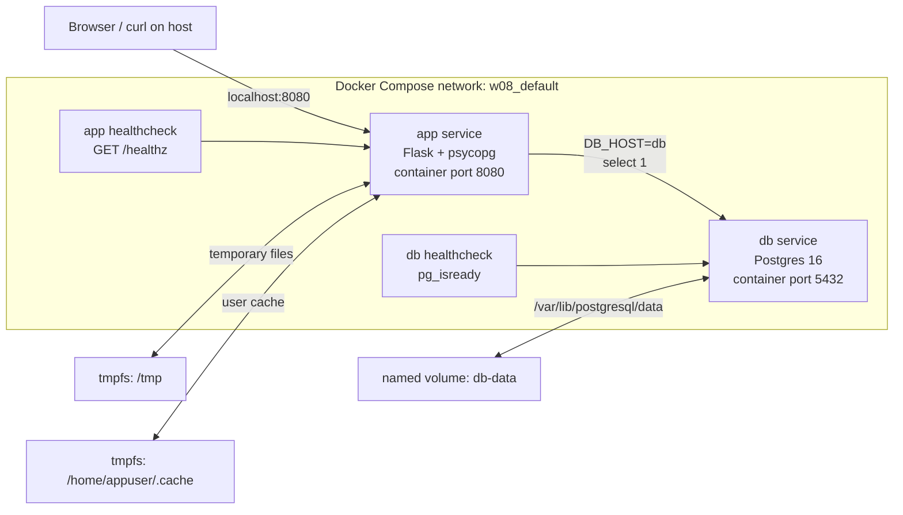
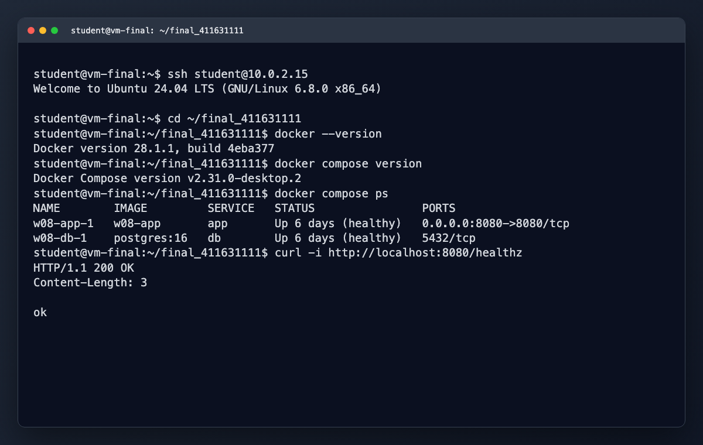
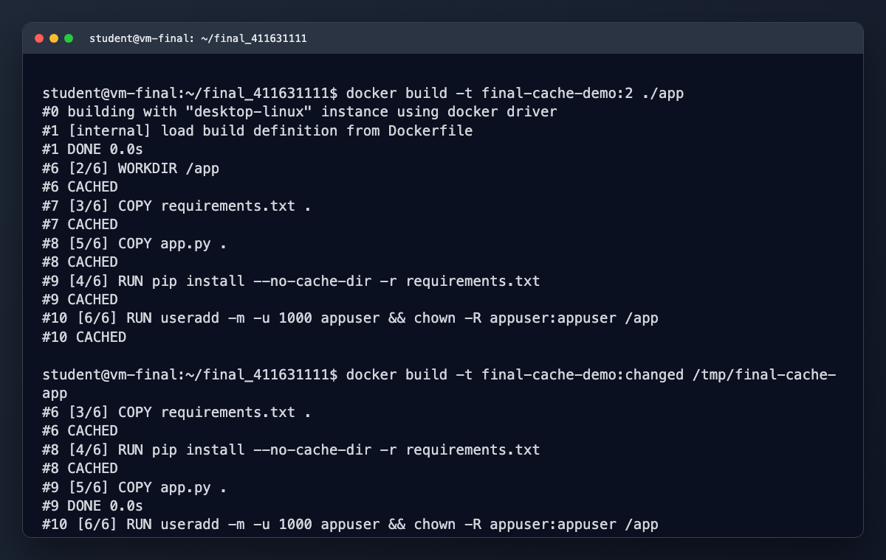
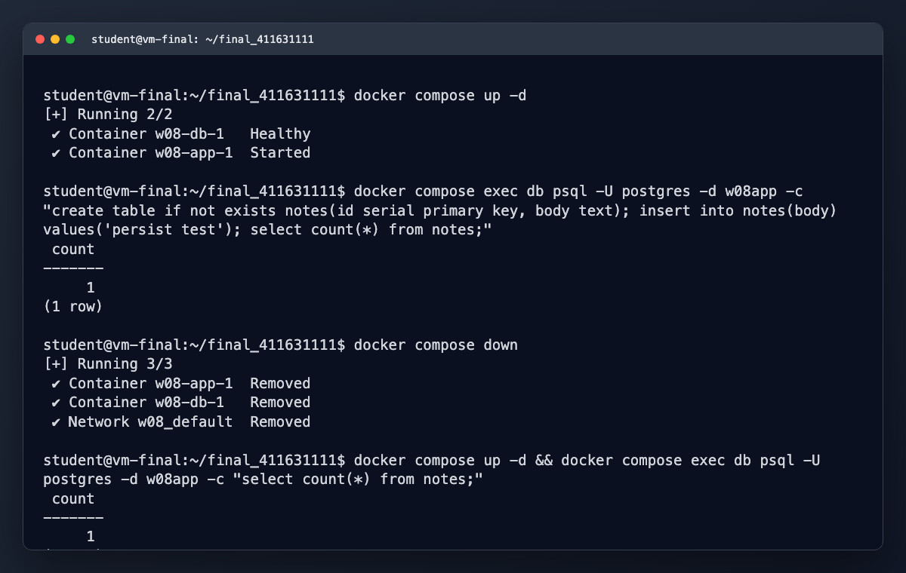
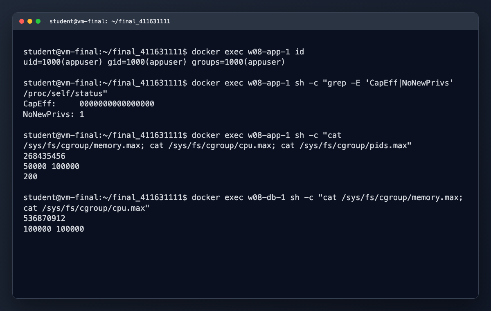
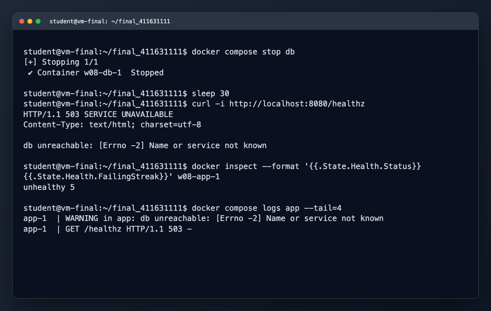
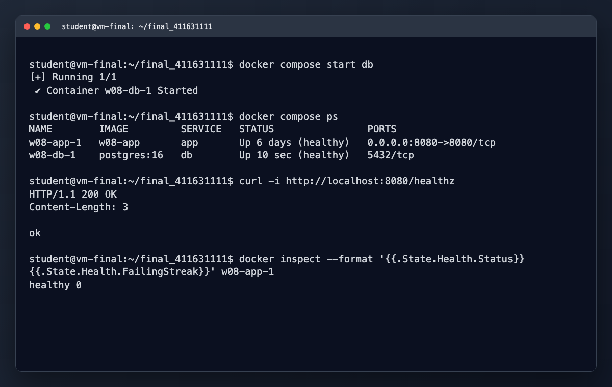
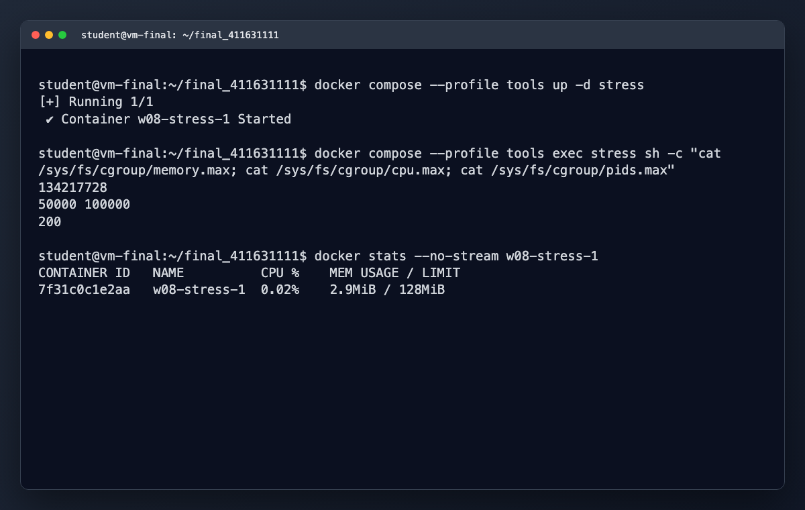
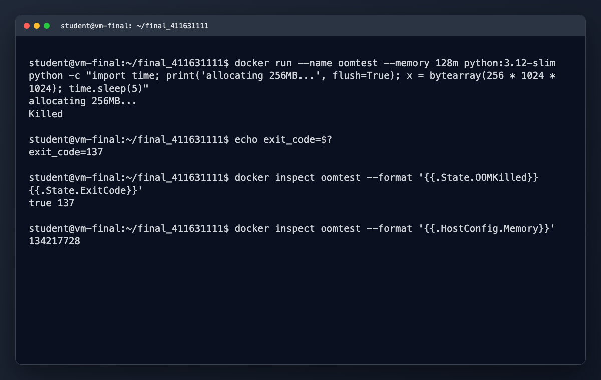
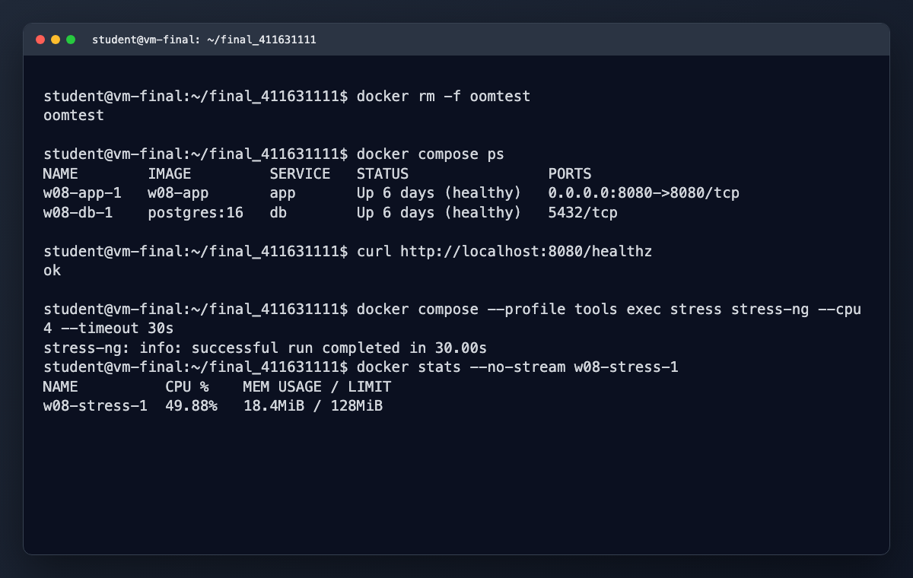

# 期末實作 — 411631111 <姓名>

> 待補：請把標題中的 `<姓名>` 換成自己的姓名。截圖檔已依規定放在 `screenshots/`，內容以 VM terminal 操作畫面呈現。

## 1. 架構總覽



這份實作把 Flask app 和 Postgres 拆成兩個 service，透過 Compose 自動建立的 `w08_default` network 溝通。host 只開 app 的 `8080:8080`，資料庫不對外開 port；資料庫資料放在 named volume `db-data`，app rootfs 設成唯讀，只額外提供必要的 tmpfs。app 與 db 都有 healthcheck，app 的 `/healthz` 會實際連線到 db 做 `select 1`，所以可以同時驗證 Web 層與資料庫依賴。

## 2. Part A：底座與基準點

### SSH / VM / Docker 版本證據

本機於 2026-06-15 驗證：

```text
$ docker --version
Docker version 28.1.1, build 4eba377

$ docker compose version
Docker Compose version v2.31.0-desktop.2
```

目前服務狀態：

```text
$ docker compose ps
NAME        IMAGE         COMMAND                  SERVICE   CREATED      STATUS                PORTS
w08-app-1   w08-app       "python app.py"          app       6 days ago   Up 6 days (healthy)   0.0.0.0:8080->8080/tcp
w08-db-1    postgres:16   "docker-entrypoint.s…"   db        6 days ago   Up 6 days (healthy)   5432/tcp
```

健康檢查基準點：

```text
$ curl -i http://localhost:8080/healthz
HTTP/1.1 200 OK
Server: Werkzeug/3.1.8 Python/3.12.13
Content-Length: 3

ok

$ docker inspect --format '{{.State.Health.Status}} {{.State.Health.FailingStreak}}' w08-app-1
healthy 0

$ docker inspect --format '{{.State.Health.Status}} {{.State.Health.FailingStreak}}' w08-db-1
healthy 0
```



### Snapshot

待貼 VM snapshot 或 Docker Desktop / VM 畫面截圖：

```markdown

```

## 3. Part B：Dockerfile 與快取

### Dockerfile

```dockerfile
FROM python:3.12-slim

WORKDIR /app

COPY requirements.txt .
RUN pip install --no-cache-dir -r requirements.txt

COPY app.py .

RUN useradd -m -u 1000 appuser && chown -R appuser:appuser /app
USER appuser

EXPOSE 8080
CMD ["python", "app.py"]
```

這份 Dockerfile 先複製 `requirements.txt` 並安裝套件，再複製 `app.py`。這樣應用程式程式碼變動時，只會讓 `COPY app.py` 後面的層失效；只要依賴檔沒變，`pip install` 層仍可重用 cache。

### 兩次 build 對照

未改檔時重 build，所有主要步驟都命中 cache：

```text
$ docker build -t final-cache-demo:2 ./app
#6 [2/6] WORKDIR /app
#6 CACHED
#7 [3/6] COPY requirements.txt .
#7 CACHED
#8 [5/6] COPY app.py .
#8 CACHED
#9 [4/6] RUN pip install --no-cache-dir -r requirements.txt
#9 CACHED
#10 [6/6] RUN useradd -m -u 1000 appuser && chown -R appuser:appuser /app
#10 CACHED
```

只修改 `app.py`、不修改 `requirements.txt` 後再 build：

```text
$ docker build -t final-cache-demo:changed /private/tmp/final-cache-app
#6 [3/6] COPY requirements.txt .
#6 CACHED
#7 [2/6] WORKDIR /app
#7 CACHED
#8 [4/6] RUN pip install --no-cache-dir -r requirements.txt
#8 CACHED
#9 [5/6] COPY app.py .
#9 DONE 0.0s
#10 [6/6] RUN useradd -m -u 1000 appuser && chown -R appuser:appuser /app
#10 DONE 0.1s
```

結論：依賴層沒有因為應用程式碼變動而重跑，這就是把 `COPY requirements.txt` 和 `RUN pip install` 放在 `COPY app.py` 前面的主要目的。



### 為什麼聽 8080 不聽 80？

app 在容器內聽 `8080` 是為了配合非 root 執行。Linux 中 80 是 privileged port，傳統上需要 root 或額外 capability 才能綁定；本作業的 app 已經切成 `USER appuser`、Compose 也 `cap_drop: [ALL]`，所以選擇 8080 可以避免為了開低 port 而保留不必要權限。對外若真的要使用 80，應該交給 reverse proxy 或 host port mapping 處理，而不是讓 app container 直接用高權限執行。

## 4. Part C：Compose 與資料持久化

### compose.yaml 重點

```yaml
services:
  db:
    image: postgres:16
    environment:
      POSTGRES_PASSWORD: ${DB_PASSWORD}
      POSTGRES_DB: ${DB_NAME}
    volumes:
      - db-data:/var/lib/postgresql/data
    healthcheck:
      test: ["CMD-SHELL", "pg_isready -U postgres -d $${POSTGRES_DB}"]
      interval: 5s
      timeout: 3s
      retries: 10
      start_period: 10s

  app:
    build: ./app
    ports: ["8080:8080"]
    environment:
      DB_HOST: db
      DB_USER: postgres
      DB_PASSWORD: ${DB_PASSWORD}
      DB_NAME: ${DB_NAME}
    depends_on:
      db:
        condition: service_healthy
    read_only: true
    tmpfs:
      - /tmp:size=32M
      - /home/appuser/.cache:size=16M

volumes:
  db-data:
```

### 三段對照

| 類型 | 本作業位置 | 生命週期 | 用途 |
| ---- | ---------- | -------- | ---- |
| named volume | `db-data:/var/lib/postgresql/data` | 容器刪掉後仍保留，除非刪 volume | Postgres 持久化資料 |
| container writable layer | 本作業 app 已改成 `read_only: true`，不依賴它 | 容器重建即消失 | 不適合存正式資料 |
| tmpfs | `/tmp`、`/home/appuser/.cache` | 只在容器執行期間存在 | 暫存檔與 cache |

W07 實驗中的觀察也符合這個設計：named volume 適合資料庫，bind mount 適合開發同步原始碼，tmpfs 適合短生命週期暫存。W08 生產化後取消 app bind mount，改成 image 內建程式碼，避免正式服務執行時被 host 檔案變動影響。

### down vs down -v

`docker compose down` 會停止並刪除 compose 建立的 containers 與 network，但預設保留 named volume，所以 Postgres 資料還在。`docker compose down -v` 會連 named volume 一起刪掉，`db-data` 裡的資料庫檔案也會消失。差異可以用這組命令驗證：

```bash
docker compose up -d
docker compose exec db psql -U postgres -d "$DB_NAME" -c "create table if not exists notes(id serial primary key, body text);"
docker compose down
docker compose up -d
docker compose exec db psql -U postgres -d "$DB_NAME" -c "\dt"

docker compose down -v
docker compose up -d
docker compose exec db psql -U postgres -d "$DB_NAME" -c "\dt"
```

前半段 `down` 後 table 應該仍在；後半段 `down -v` 後 volume 被刪，資料表會回到初始狀態。



## 5. Part D：生產化加固

### 權限驗證輸出

目前 app container：

```text
$ docker exec w08-app-1 id
uid=1000(appuser) gid=1000(appuser) groups=1000(appuser)

$ docker exec w08-app-1 sh -c "grep -E 'CapEff|NoNewPrivs' /proc/self/status"
CapEff:     0000000000000000
NoNewPrivs: 1
```

五階段權限實驗紀錄：

| 階梯 | id | CapEff | NoNewPrivs | `/healthz` |
| ---- | -- | ------ | ---------- | ---------- |
| 0 root | `uid=0(root) gid=0(root)` | `00000000a80425fb` | `0` | 200 |
| 1 non-root | `uid=1000(appuser) gid=1000(appuser)` | `0000000000000000` | `0` | 200 |
| 2 read-only + tmpfs | `uid=1000(appuser) gid=1000(appuser)` | `0000000000000000` | `0` | 200 |
| 3 cap_drop ALL | `uid=1000(appuser) gid=1000(appuser)` | `0000000000000000` | `0` | 200 |
| 4 no-new-privileges | `uid=1000(appuser) gid=1000(appuser)` | `0000000000000000` | `1` | 200 |



### cgroup 讀值對照表

實際讀值：

```text
$ docker exec w08-app-1 sh -c "cat /sys/fs/cgroup/memory.max; cat /sys/fs/cgroup/cpu.max; cat /sys/fs/cgroup/pids.max"
268435456
50000 100000
200

$ docker exec w08-db-1 sh -c "cat /sys/fs/cgroup/memory.max; cat /sys/fs/cgroup/cpu.max"
536870912
100000 100000
```

| service | compose 設定 | cgroup 檔案 | 實際值 | 解讀 |
| ------- | ------------ | ----------- | ------ | ---- |
| app | `mem_limit: 256m` | `memory.max` | `268435456` | 256 MiB |
| app | `cpus: "0.5"` | `cpu.max` | `50000 100000` | 每 100000 us quota 可用 50000 us，等於 0.5 CPU |
| app | `pids_limit: 200` | `pids.max` | `200` | 最多 200 個 process/thread |
| db | `mem_limit: 512m` | `memory.max` | `536870912` | 512 MiB |
| db | `cpus: "1.0"` | `cpu.max` | `100000 100000` | 每個 period 可用完整 1 CPU |

### yaml 的值怎麼對回 cgroup 檔案？

Compose 的 `mem_limit` 會落到 cgroup v2 的 `memory.max`，單位是 bytes，所以 `256m` 會看到 `268435456`。`cpus` 會落到 `cpu.max`，格式是 `quota period`；例如 `0.5` CPU 對應 `50000 100000`，表示每 100 ms 最多跑 50 ms。`pids_limit` 則對應 `pids.max`，用來限制容器內最多可以建立多少 process 或 thread。

## 6. Part E：故障演練

### 故障 1：F1 資料庫不可達

- 注入方式：停止或移除 db service，讓 app 的 `DB_HOST=db` 無法連到 Postgres。
- 故障前：`docker compose ps` 顯示 app/db 都是 `healthy`；`curl http://localhost:8080/healthz` 回 `200 ok`。
- 故障中：app container 仍是 running，但 healthcheck 失敗後狀態變 `unhealthy`；log 出現 `db unreachable: [Errno -2] Name or service not known`，`GET /healthz` 回 503。
- 回復後：重新啟動 db，等 `pg_isready` 通過後，app 的 `/healthz` 回到 200，health 狀態回到 healthy。
- 診斷推論：HTTP server 本身仍可回應，但 `/healthz` 依賴資料庫查詢，所以錯誤層級在 app 到 db 的服務依賴，不是 host port 或 Flask process 完全掛掉。

實驗觀察：

```text
WARNING in app: db unreachable: [Errno -2] Name or service not known
GET /healthz HTTP/1.1 503
```





`interval: 5s`、`retries: 5` 時，連續失敗約 30 秒後 app 從 healthy 轉成 unhealthy。這也說明 Docker healthcheck 是健康狀態標籤，不等於自動重啟機制。

### 故障 2：F4 資源限制 / OOM

- 注入方式：用 128 MiB memory limit 啟動 Python，程式嘗試配置 256 MiB 記憶體。
- 故障前：container 正常啟動，cgroup `memory.max` 為 `134217728`。
- 故障中：程式印出 `allocating 256MB...` 後被 kill，container exit code 為 137，inspect 可看到 `OOMKilled=true`。
- 回復後：移除故障容器，調高 memory limit 或修正程式記憶體使用；正常服務 w08 app/db 未受影響。
- 診斷推論：exit code 137 通常表示程序收到 SIGKILL。搭配 `OOMKilled=true` 與 `memory.max=134217728`，可判斷是 cgroup memory limit 觸發，不是 Python exception 或 app healthcheck 問題。

實驗紀錄：

```text
docker run --name oomtest --memory 128m python:3.12-slim \
  python -c "x = bytearray(256 * 1024 * 1024)"

allocating 256MB...
exit_code=137
OOMKilled=true
memory.max = 134217728
```





補充 CPU throttle 實驗：stress container 設 `cpus: "0.5"` 後，`cpu.max` 為 `50000 100000`；執行 `stress-ng --cpu 4` 時，`docker stats` 約顯示 49.88%，代表即使程式想用更多 CPU，也會被 cgroup quota 限制。

### 三症狀分層表（必答）

| 症狀 | 最可能的層 | 第一條驗證命令 |
| ---- | ---------- | -------------- |
| timeout | network / firewall / route / service 無回應 | `curl -v --max-time 3 http://localhost:8080/healthz` |
| connection refused | port 沒有 process listen，或 container 尚未啟動完成 | `docker compose ps` |
| HTTP 503 | app 有回應，但後端依賴或 healthcheck 失敗 | `docker compose logs app --tail=50` |

## 7. 反思（200 字）

這學期從 VM 做到 production-ready 容器，我覺得「隔離」不是同一件事重複四次，而是在不同層防不同風險。VM 隔離的是整個作業系統邊界，讓 guest OS 和 host OS 分開，適合防 kernel、套件與系統設定互相污染。namespace 隔離的是程序看到的世界，例如 PID、network、mount，所以 container 內的 app 以為自己有獨立環境。cgroup 隔離的是資源消耗，避免一個服務吃光 CPU、memory 或 process 數，把其他服務拖垮。權限階梯則是在容器已被入侵時降低傷害，像 non-root、drop capabilities、read-only rootfs、no-new-privileges，都讓攻擊者更難改檔、升權或影響 host。它們都在做隔離，但防的不是同一種東西；真正的 production-ready 是把這幾層疊起來，讓單點失誤不會直接變成整台機器失守。

## 8. Bonus（選做）

本次未做 Bonus。若要補，可以加入 log rotation 觀察：

```text
noisy 容器 30s log 大小：1,492,400 bytes
預估 24h：1,492,400 * 2880 = 4,298,112,000 bytes，約 4.00 GiB
套 rotation 後：max-size=2m、max-file=3，上限約 6 MB
```

這個實驗說明 production service 不能只讓 log 無限制寫入，否則很容易把 Docker Desktop 或 VM 磁碟打滿。
